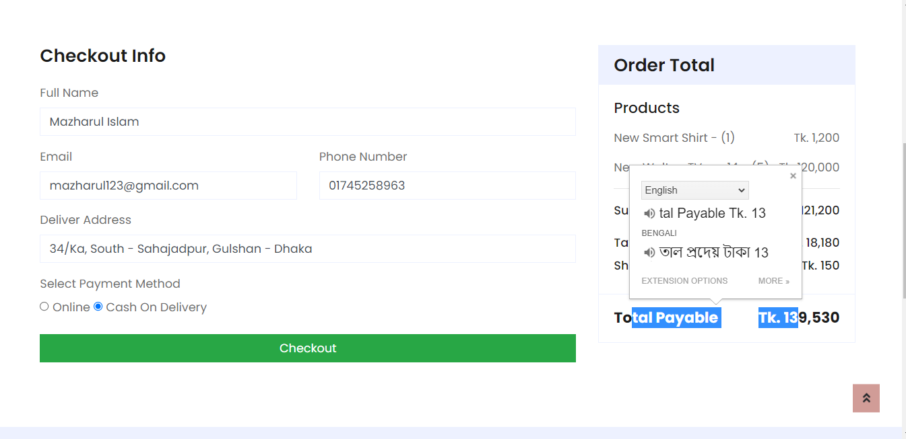
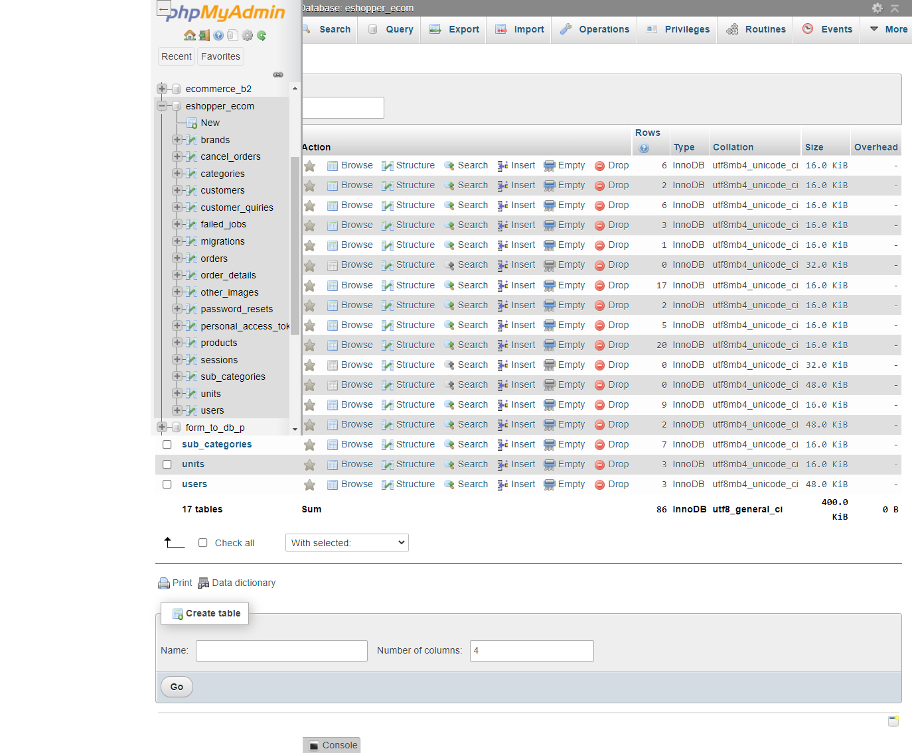

## Completely Dynamic E-Commerce Website with Laravel - 9 (Front + Admin)
  
#### Project Description  
This is a dynamic ecommerce website with separate frontend and admin panel,
where admin will be able to manage all the activities like add and manage
category, subcategory, brand, unit, product and also manage to edit 
orders has been coming from users. 

#### Technology Used
    1. HTML 
    2. CSS
    3. Bootstrap
    4. JavaScript
    5. jQuery
    6. Laravel 
    7. MySQL DB
    
  #### Project Demo : 
  ###### Please Click over the image to see better quality
  
  
  
  
  
  
  
  

  
  
  
  
  
  
  #### Admin  
   
   
   
   

  
  #### Project Author
  Name: Mazharul Islam  
  Professional Full Stack Web Developer  
  Email: mazharulislam1998r@gmail.com  
  Cell: +880 1638574281  
  
  Thanks
  

